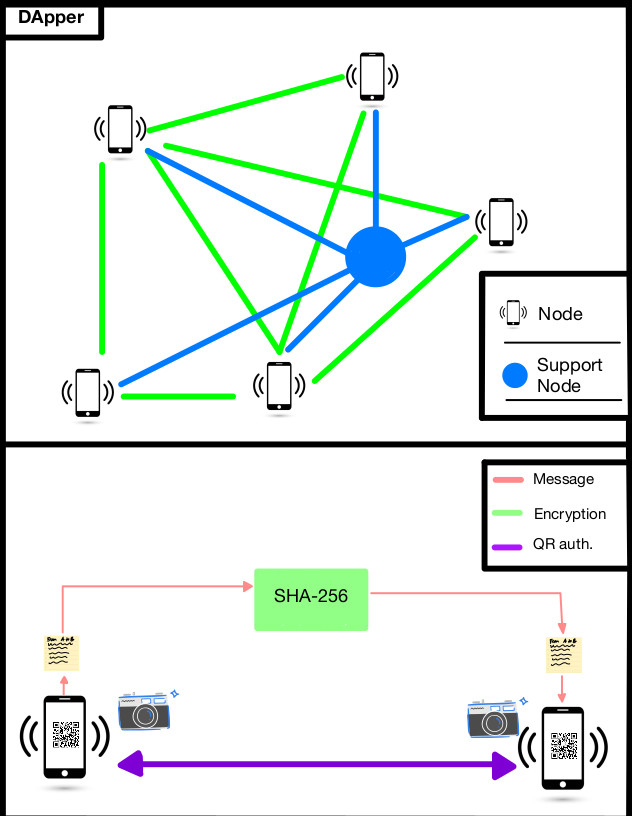

# DApper (spider messenger)

Dectentralized messenger / Comp Security Final project 

## possible mechanisms 

### using a decentralized graph data base (gunDB)

- we have decided to go this route and will be using sveltekit with gunDB.
- here is a representation of our basic idea wherein each phone/ user is a node in the graph.

## Timeline 

- **Due Date**
  - Demo due november 29th? 
  - December 12th
    - min viable product --> 2 computers sending encrypted messages via gunDB using sveltekit
    - ideally, something that supports login and user auth 
- Setting up Gun Db (Cam)
  - understanding / instantiating a gunDB that has data inside of it and can be accessed after restarting server 
  - done by novemeber 14 
- getting some sort of UI / user auth (can be nonfunctional at this time) (Cade)
  - forms for login / make account 
  - user auth package to create users (doesn't have to be stored in gunDB yet)
  - done by novemeber 14th 
- storing user credentials in GunDB 
  - using some sort of hash save user auth into gunDB 
  - due novemeber 17th (Friday at latest if harder than expected)
- encrytion of messges, this can be done with a SHA256 package 
  - find a method to encrypt messages with SHA256, using some package 
  - due novemeber 17th 
- Find a way to store messages in GunDB 
  - have semi perminent storage of message data (encrypted) in gunDB
  - due november 21st
- find a way to display data from GunDB using svelte (mutate UI with information from GunDB)
  - as simple as displaying user's name when they login as the name will be accessed from gun 
  - due novemebr 21st
- from here on focus on getting messaging to work, ie figuring out how to exchange public keys is extra, eventually will impliment but for due date
just need to show messages are encrypted and user info is hashed, and both are stored in gunDB. 

- [x] we have everything done right now 
  - we have: 
    - hashed passwords 
    - encrypted messages
    - async display of messages as they come in 
    - seamless sending of messages and auto updating

### Block chain piggy back (alternative approach)

- [dart](https://ethereum.org/en/developers/docs/programming-languages/dart/)
- https://pub.dev/packages/web3dart
- [python](https://ethereum.org/en/developers/docs/programming-languages/python/)
- [python](https://levelup.gitconnected.com/dapps-development-for-python-developers-f52b32b54f28)
- https://ipdb.io/resources/
- https://github.com/bigchaindb
- https://dev.to/gcrsaldanha/persist-data-to-the-ethereum-blockchain-using-python-truffle-and-ganache-47lb
